* * *

در صورتی که نسخه تک صندوقه نرم افزار فروشگاهی رایما را خریداری کرده اید، نحوه نصب آن را مطابق مطالب زیر انجام دهید.

بر روی فایل "Setup.Local.exe " (از نوع Application) در داخل بسته نرم افزاری خریداری شده دو مرتبه کلیک کنید. حال چند ثانیه صبر کنید تا برنامه شروع به نصب کند.

SQL Server 2012 Express (و بالاتر) و.NET Framework 4.6 از پیش نیازهای نصب نرم افزار بر روی سیستم شما محسوب می**‌**شوند که به صورت پیش فرض در بسته نرم افزاری شما در کنار فایل نصب قرار داده شده است و اگر این دو برنامه از قبل روی سیستم شما نصب باشند، برنامه به طور خودکار وارد نصب اصلی نرم افزار بر روی سیستم شما می**‌**شود.

 

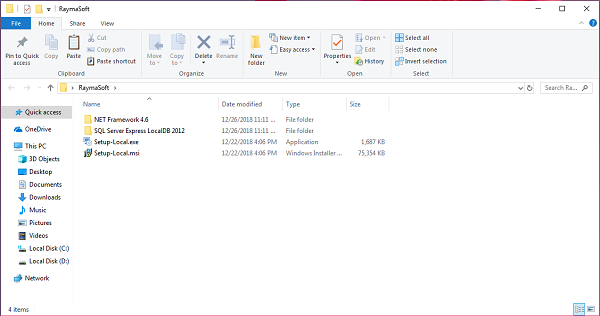

 

در این صفحه روی دکمه "بعدی" کلیک کنید تا به مرحله بعد بروید**.**

 

 

در این مرحله باید مسیر نصب نرم افزار را (که به طور پیش فرض درایوی را که ویندوز بر روی آن نصب شده است را انتخاب می‌کند) تعیین کنید؛ توجه داشته باشید مسیر نصب باید حداقل فضای مورد نیاز نصب برنامه را داشته باشد.

 

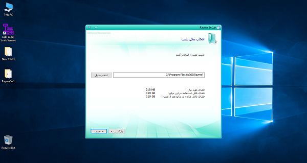

 

با انتخاب دکمه نصب، مراحل نصب نرم افزار آغاز می‌شود.

 

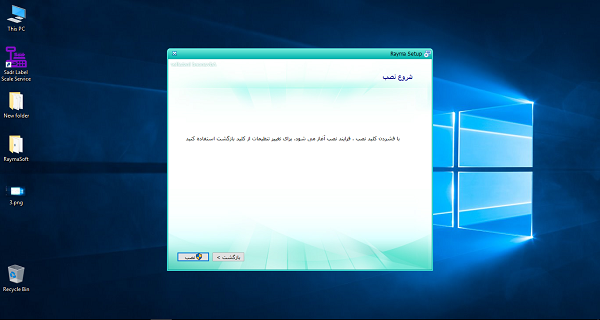

 

در حالت نصب نرم افزار لوکال پس از انتخاب دکمه نصب در مرحله قبل، نرم افزار وارد مرحله نصب می**‌**شود و باید در این مرحله اندکی صبر کنید تا مراحل نصب تکمیل شود.

 

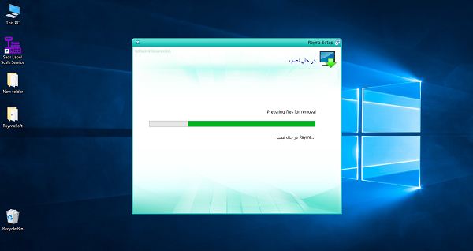

 
/r/n
در صورتی که نرم افزار به درستی بتواند بر روی سیستم شما نصب شود، پیغام موفقیت در پنجره شکل زیر را می**‌**بینید.

 

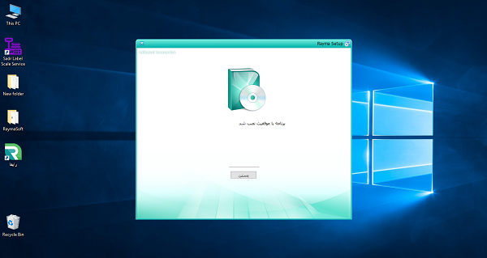

 

پس از انتخاب دکمه "بستن"، شورتکات آیکن نرم افزار را می**‌**توانید بر روی صفحه اصلی ویندوز خود مشاهده کنید.

 

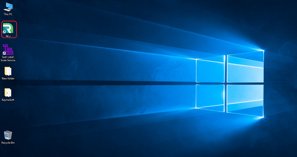

 

با دابل کلیک بر روی شورتکات نرم افزار برنامه را اجرا کنید.

 

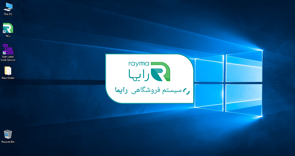

 

جهت ورود به نرم افزار، نام کاربری و کلمه عبور اختصاصی کاربر را وارد کنید. لازم به ذکر است پنجره زیر در صورتی به شما نمایش داده می‌شود که مراحل فعال سازی (سوال 3 در همین بخش) را انجام داده باشید.

 

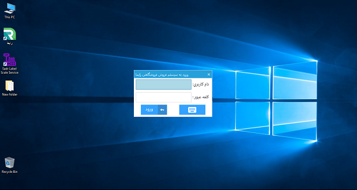

 

در صورتی که نسخه چند صندوقه نرم افزار فروشگاهی رایما را خریداری کرده**‌**اید، نحوه نصب آن را مطابق مطالب زیر انجام دهید.

بر روی فایل "Setup. Server " (از نوع Application) در داخل بسته نرم افزاری خریداری شده دو مرتبه کلیک کنید و چند ثانیه صبر کنید تا برنامه شروع به نصب کند.

ماکروسافت اس کیو ال 2012SQL Server 2012 Express SP2 (و بالاتر) و .NET Framework 4.6 از پیش نیازهای نصب نرم افزار بر روی سیستم شما محسوب می**‌**شوند که به صورت پیش فرض در بسته نرم افزاری شما در کنار فایل نصبی قرار داده شده است و اگر این دو برنامه از قبل روی سیستم شما نصب شده باشند، برنامه به طور خودکار وارد مراحل نصب اصلی نرم افزار بر روی سیستم شما می**‌**شود.

 

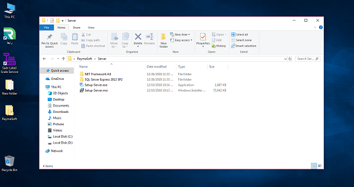

 

در این صفحه روی دکمه "بعدی" کلیک کنید تا به مرحله بعد بروید.

 

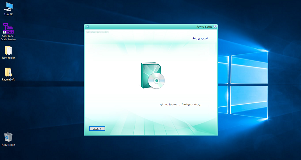

 

در این مرحله باید مسیر نصب نرم افزار را (که به طور پیش فرض درایوی را که ویندوز بر روی آن نصب شده است را انتخاب می‌کند) تعیین کنید؛ توجه داشته باشید مسیر نصب باید حداقل فضای مورد نیاز نصب برنامه را داشته باشد.

 

 

با انتخاب دکمه نصب، مراحل نصب نرم افزار آغاز می**‌**شود.

 

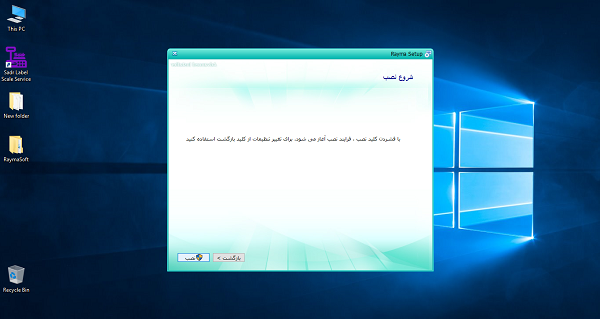

 

در حالت نصب نرم افزار چند صندوقه، نسخه سرور را بر روی سیستمی که قرار است بانک اطلاعاتی مرکزی بر روی آن نصب شود نصب کنید.

 

 

در صورتی که قصد نصب نرم افزار بر روی سیستم سایر کاربران را دارید، نسخه کلاینت را نصب کنید.

 

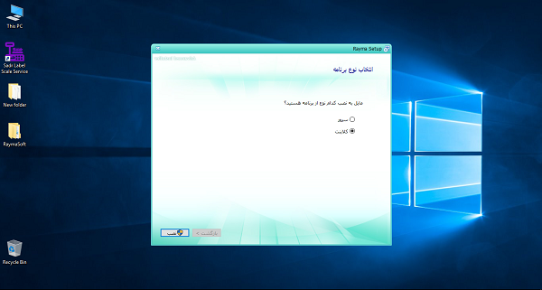

 

پس از انتخاب دکمه نصب در مرحله قبل، نرم افزار وارد مرحله نصب می**‌**شود و باید در این مرحله کمی صبر کنید تا مراحل نصب تکمیل شود.

 

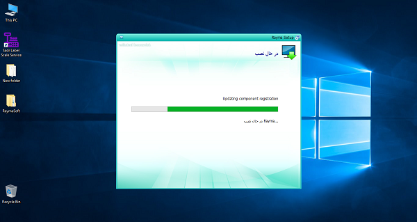

 

در صورتی که نرم افزار به درستی بتواند بر روی سیستم شما نصب شود، پیغام موفقیت در پنجره شکل زیر را می**‌**بینید.

پس از انتخاب دکمه "بستن"، شورتکات نرم افزار روی دسکتاپ سیستم شما ایجاد می**‌**شود.

 

 

با دابل کلیک بر روی شورتکات، برنامه را اجرا نمایید.

 

 

پس از انتخاب آیکن نرم افزار، در اولین ورود به سیستم پنجره شکل زیر را می**‌**بینید؛ در صورتی که نسخه سرور نرم افزار را نصب کرده باشید، قسمت آدرس قفل را باید با آدرس IP و یا Computer Name سیستم دارای قفل تکمیل کنید. در قسمت مرتبط با نام سرور، باید با نام سرور بانک اطلاعاتی خود تکمیل کنید؛ ضمنا قرار دادن نقطه (".") در این فیلد به معنای انتخاب کامپیوتر حاضر (کامپیوتری که در حال حاضر در حال نصب نرم افزار بر روی آن هستید و بانک اطلاعاتی بر روی آن نصب شده است) می**‌**باشد. در قسمت نام دیتابیس، نام دیتابیس مورد نظر خود را وارد کنید و در نهایت در قسمت نام کاربری و کلمه عبور نیز باید User name و Pass word بانک اطلاعاتی خود را وارد کنید.

در صورتی که نسخه کلاینت نرم افزار را نصب کرده باشید، قسمت آدرس قفل را باید با آدرس IP و یا Computer Name سیستم دارای قفل تکمیل کنید. در قسمت مرتبط با نام سرور، باید با نام سرور بانک اطلاعاتی خود تکمیل کنید. در قسمت نام دیتابیس، نام دیتابیس مورد نظر خود را وارد کنید و در نهایت در قسمت نام کاربری و کلمه عبور نیز باید User name و Pass word بانک اطلاعاتی خود را وارد کنید.

 

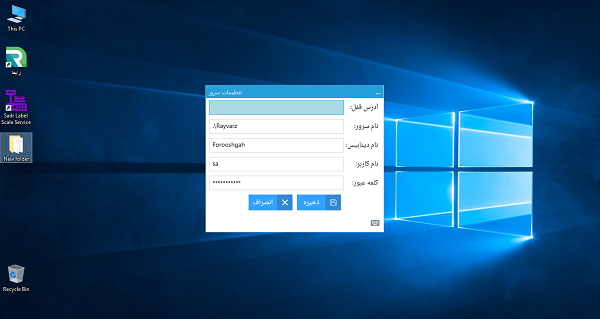

 

نکته. در صورتی که پنجره فوق جهت تکمیل اطلاعات نرم افزار چند صندوقه مقابل شما به شکل پنجره زیر باز شد، گزینه مشخص شده در شکل زیر را انتخاب کنید.

 

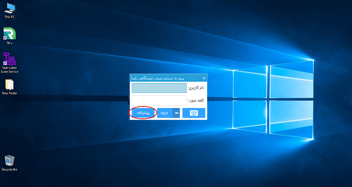

 

پس از انتخاب گزینه ذخیره در مرحله قبل در نرم افزار، باید جهت ورود به نرم افزار، نام کاربری و کلمه عبور اختصاصی کاربر را وارد کنید. لازم به ذکر است پنجره زیر در صورتی به شما نمایش داده می**‌**شود که مراحل فعال سازی (سوال 3 در همین بخش) را انجام داده باشید.

 

