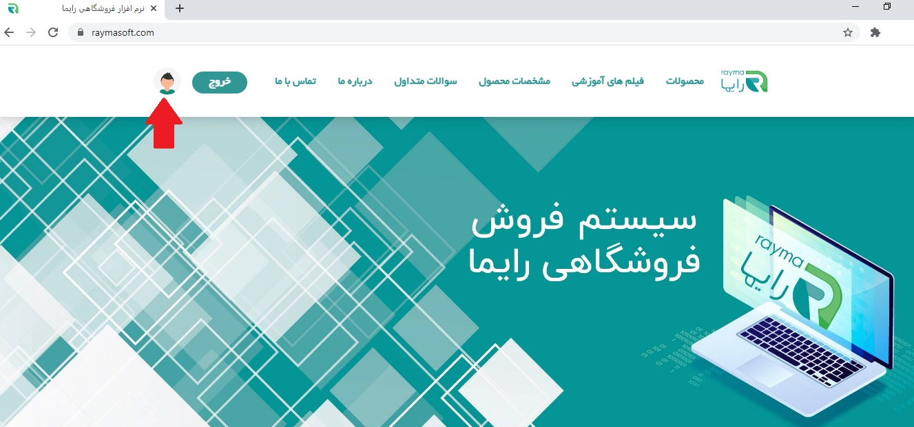
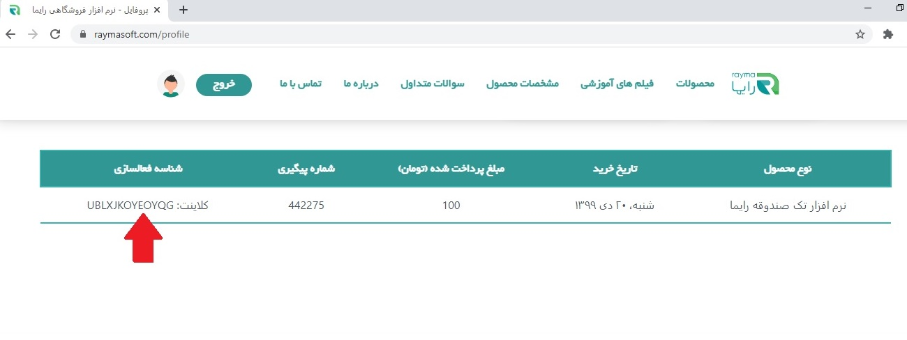
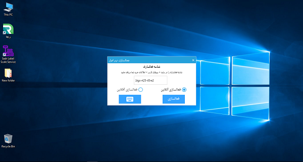
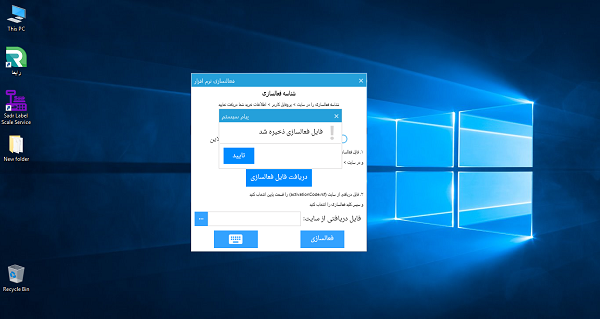

* * *

نحوه فعال سازی قفل نرم افزاری پس از خرید نرم افزار رایما چگونه است؟

پس از تکمیل فرآیند خرید نرم افزار، لینک دانلود نرم افزار فعال می**‌**شود که باید آن را دانلود و سپس نصب کنید. (در صورت عدم دانلود در انتهای مرحله خرید، لینک دانلود نرم افزار در پروفایل شما نیز موجود می**‌**باشد.) سپس به پروفایل کاربری خود در منو فوقانی وبسایت مراجعه کنید و از قسمت "اطلاعات خرید شما"، شناسه فعال سازی 13 رقمی نرم افزار خود را کپی کنید.

 

 

 

نرم افزار خود را اجرا کنید. در این مرحله فرم فعال سازی نرم افزار را مشاهده می**‌**کنید.

فعال سازی نرم افزار به صورت آنلاین امکان پذیر است.

 

 

فعال سازی آنلاین. در صورتی که سیستم شما به اینترنت متصل باشد، تنها کافی است شناسه فعال سازی**‌**ای را که پس از خرید نرم افزار کپی کرده بودید، در قسمت شناسه فعال سازی فرم فعال سازی نرم افزار وارد کرده و دکمه "فعال سازی" را انتخاب کنید. سیستم شناسه فعال سازی شما را شناسایی کرده و نرم افزار پس از نمایش پیغام زیر اجرا می**‌**شود.

 

