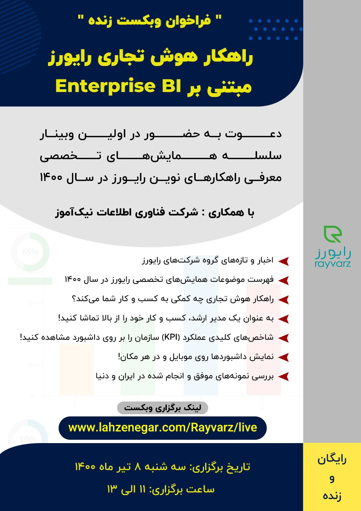

هوش تجاری یا Intelligence Business شامل مجموعه ای از مهارت ها، تکنولوژی ها، شاخص ها و برنامه های کاربردی
می باشد که به منظور جمع آوری، یکپارچه سازی، تجزیه و تحلیل و ایجاد دسترسی به داده های سازمان مورد استفاده
قرارمی گیرند . چنانچه بخواهیم به طور خیلی ساده هوش تجاری را تعریف کنیم می توان گفت که هوش تجاری شامل کلیه
روش ها و فرآیندهای کامپیوتری است که داده را به اطلاعات و سپس به دانش تبدیل می کند.
مدیران ارشد سازمانها میتوانند بر اساس داشبوردهای مدیریتی که راهکار هوش تجاری
رایورز ارائه میکند، تصمیمات درست و داده محور بگیرند.

 

    <a href="https://lahzenegar.com/Rayvarz/live">لینک برگزاری وبکست</a>

 

